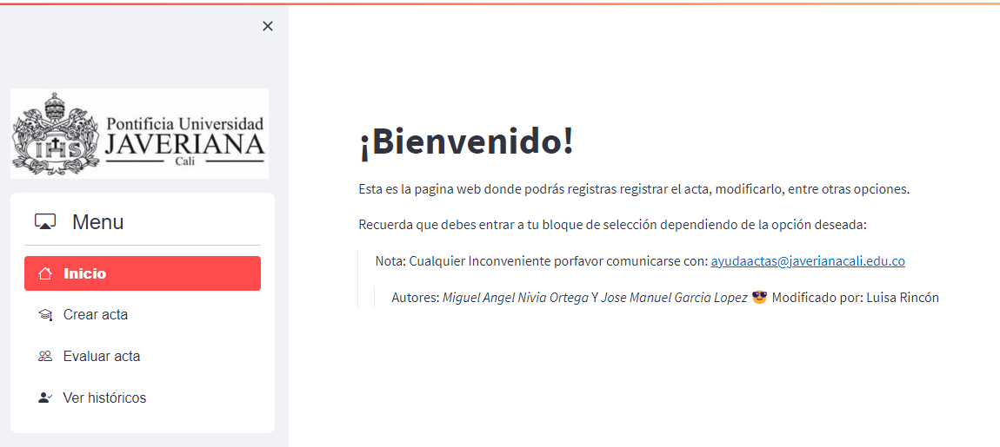

# 2022-1 Gestión de actas de proyecto de grado
> Lenguaje Usado -> Python 3.10
> Ver el resto de requerimiento en el archivo de `requierements.txt`

## Autores:
Código elaborado en el curso de POO 2022-1 por
> * Jose Manuel García(8959600)
> * Miguel Angel Nivia Ortega(8958691)

>Ajustado por Luisa Rincón en 2022-2

## Enunciado:
La dirección de los posgrados en ingeniería de software de la Pontificia Universidad Javeriana Cali quiere hacer un
sistema de información que facilite la calificación de los trabajos de grado de maestría cuando los estudiantes realizan
su sustentación pública. La directora espera que el sistema entregue un pdf con los resultados de la
calificación obtenida por el estudiante y los comentarios relacionados con la evaluación. Esta evaluación se registra
en un acta de evaluación que es diligenciada luego de la sustentación por los dos jurados participantes y está
compuesta por:
* Número, fecha, autor, nombre del trabajo, tipo de trabajo ( 1. Aplicado, 2. Investigación ), director,
codirector (algunas veces existe un codirector), jurado 1, jurado 2.
* Criterios de evaluación. Actualmente son 8 criterios de evaluación pero podrían extenderse en el futuro.
Cada criterio tiene un identificador, un texto que es el texto que se presenta a los evaluadores y un
porcentaje de ponderación. El porcentaje de ponderación está definido por la dirección de los posgrados.
Eventualmente podría ser ajustados por la dirección de los posgrados.
* En el acta para cada criterio de evaluación se incluye la calificación del jurado número 1 y la calificación del
jurado número dos y los comentarios específicos para el criterio.
* El acta permite incluir observaciones adicionales y comentarios específicos sobre las condiciones para la
aprobación del trabajo final

## Principales Funcionalidades:
Este programa se encarga de facilitar el proceso de actas de un grado, el cual dependiendo el rol de la persomna
encargada este efectuara y tendrá disponibilidad de diversas funciones, siendo las siguientes:
>Funcionalidades:
* Crear una acta
* Ver el histórico de las actas.
* Calificar las actas creadas 
* Generar un PDF de las actas ya calificadas.

## Actividades de exploración y modificación del código fuente
* Instale el proyecto. Cree el ambiente virtual, actívelo, e instale las librerías definidas en el requirements.txt. Siga las instrucciones de instalación disponibles aquí en ``Insalacion proyetos strealmlit.pdf``
* Corra el proyecto, debería ver algo similar a lo que muestra la siguiente imagen

1. Identifique en el código fuente donde se inicializan los criterios. Agregue un criterio nuevo que valga el 5%. Modique el criterio `Validez de los resultados y conclusiones para que solo valga el 15%`
2. Observe el código que en la interfaz gráfica recorre los criterios y los muestra. Note que a fin de que en la interfaz gráfica no aparezcan controles con nombres repetidos es importante agregar un identificador único a cada control visual. 
3. Agregue como parte de la información que se requiere para crear el acta la `fecha de presentación`. Modifique el PDF y el histórico de actas para que esta modificación quede incluida.
4. Agregue un método en el controlador que retorne la lista de directores, los directores posibles son:
     * Luisa Fernanda Rincon
     * Juan Carlos Martinez
     * Maria Constanza Pabón
     * Gloria Inés Álvarez
     * Gerardo M Sarria M
     * Luis Eduardo Tobón
     * Juan Pablo García
     * Frank Martinez
     * Carlos Ramirez
5. Modifique el programa para que cuando se crea el acta el usuario pueda escoger un director de la lista de directores 
6. Modifique el programa para que cuando se cre el acta al seleccionar los jurados se pueda seleccionar si lo jurados son internos o externos. Use un checkbox como control de la interfaz gráfica para lograr este comportamiento 
7. Modifique el programa para que exportar el acta sea una opción nueva en el menú. 
8. Modifique el pdf para que aparezca como nombre del trabajo el nombre digitado en el formulario de creación de actas. Note que en este momento siempre aparece el mismo texto como se observa en la siguiente imagen.

9. Modifique el programa para que en la evaluación del acta pueda agregar información para: observaciones adicionales y restricciones que limitan la calificación final. Modifique la generación del pdf para incluir esta información 
10. Agregue una nueva opción de menú llamada ``Estadísticas``.  Presente ahí: la cantidad de proyectos de grado aplicados y de investigación que se han registrado en el sistema.  La cantidad de proyectos de grado que tienen jurados externos y la cantidad que tienen proyectos internos así como la cantidad de proyectos de grado que tienen una nota superior a 4.8 
11. Modifique el PDF para que donde aparece ``Nombre Jurado Uno``  y ``Nombre Jurado Dos`` aparezcan los nombres reales de los jurados
.
12. Explore la librería plotly. Intente hacer alguna gráfica que represente estadísticas almacenadas en el sistema de información.

## Entregables
* Haga commit de los avances como producto suba al repositorio un pdf con imágenes que evidencie la ejecución de cada punto [ del 1 al 12]